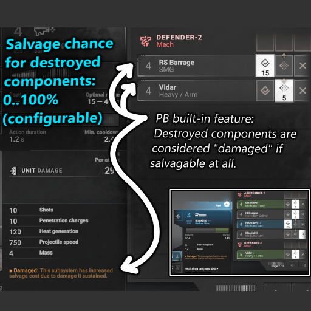

## Overview

Phantom Brigade v2.0 has a yes/no difficulty option: Either you can salvage all destroyed components, or you can salvage none of them.

This mod makes each destroyed part salvagable with 50% probability. There's also a config file where you can adjust that probability.

Steam Workshop page: https:// TODO

## Questions & Answers

### How do I change the probability?

In the game's logs etc directory:

AppData\LocalLow\Brace Yourself Games\Phantom Brigade

Launch the game and it will create file: enhanced_salvage_of_destroyed_parts_config.json

Below is an example content for this file (the {} curly-braces and everything inside them).
A value of 0.75 represents 75% for a part to be salvagable after it is destroyed.
You can edit this file to change this value to anything between 0.00 to 1.00.

{
    "salvagable_destroyed_part_success_chance": 0.75
}

### Some things are never salvageable?

Phantom Brigade seems to have some built-in logic to prevent salvage of some things. This mod does not attempt override that logic.

The Cargo Rack is one example:
Part entity back_cargo_salvage (E-ID 319) contains subsystem blocking salvage: back_cargo_salvage_1 (E-ID 320)

### What about save games?

This mod does not save or load any persistent data. It should work with existing saves, and shouldn't break any saves, including if you deactivate this mod.
